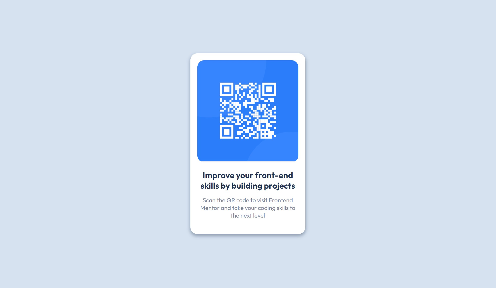

# Frontend Mentor - QR code component solution

This is a solution to the [QR code component challenge on Frontend Mentor](https://www.frontendmentor.io/challenges/qr-code-component-iux_sIO_H).
## Table of contents

- [Overview](#overview)
  - [Screenshot](#screenshot)
  - [Links](#links)
- [My process](#my-process)
  - [Built with](#built-with)
  - [What I learned](#what-i-learned)
  - [Continued development](#continued-development)
  - [Useful resources](#useful-resources)
- [Author](#author)


## Overview

### Screenshot



### Links

- Solution URL: https://www.frontendmentor.io/solutions/qr-card-using-flexbox-2GiRx4E0y_
- Live Site URL: https://vaibhavityagi.github.io/qr-code/

## My process

### Built with

- Semantic HTML5 markup
- Flexbox

### What I learned

Learned how to round corners of an image and understood the actual use of overflow property.

Here are the snippets

```html
<figure>
  
</figure>
```
```css
.container figure {
  background-color: rgba(31, 50, 81, 0.1);
  border-radius: 20px;
  overflow: hidden;
  margin-bottom: 5px;
}
```

### Continued development

I would continue learning better semantics and incorporating flexbox into bigger projects so that I can have a strong command over it. 
Along with flexbox, I am learing to use grid. Would be creating more projects incorporating both grid and flexbox.

### Useful resources

- https://www.youtube.com/watch?v=3YW65K6LcIA - This helped me understand the basics of flexbox. The mini project at the end provides an escape from tutorial hell. 
- https://www.youtube.com/watch?v=1zKX71GYisE - This gave me a more in-depth knowledge of flexbox. Definitely check it out!
- https://flexboxfroggy.com/ - This fun little game really cemented my basic knowledge of flexbox.


## Author

- Frontend Mentor - [@vaibhavityagi](https://www.frontendmentor.io/profile/vaibhavityagi)
- Twitter - [@vaiviiiii](https://www.twitter.com/vaiviiiii)
